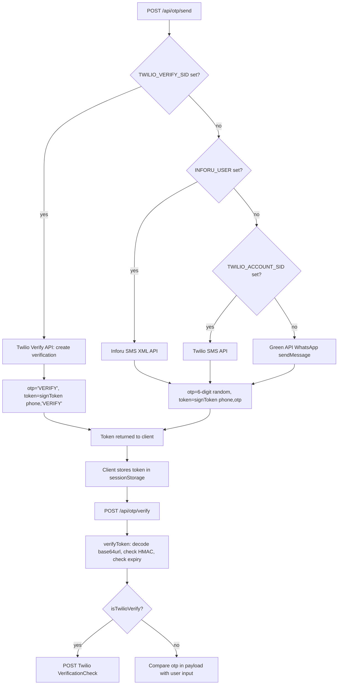

# Audit 01 — System Map

**Project:** שווי דירה נתניה — Real-Estate Lead-Gen (Next.js 14 App Router)
**Audit date:** 2026-08-19
**Auditor:** Claude Sonnet 4.6 (forensic read-only pass)

---

## 1. Technology Stack

| Layer | Technology | Status |
|---|---|---|
| Framework | Next.js 14 (App Router, Node.js runtime) | VERIFIED |
| Language | TypeScript | VERIFIED |
| Auth | NextAuth v5 (Google OAuth) | VERIFIED |
| Primary DB | Supabase (Postgres) — env-gated | VERIFIED |
| Fallback DB | JSON flat files under `data/` | VERIFIED |
| Notifications | Green API (WhatsApp) + Google Sheets webhook | VERIFIED |
| OTP SMS | Inforu → Twilio SMS → Green API WA (priority chain) | VERIFIED |
| OTP Verify | Twilio Verify (separate flow when TWILIO_VERIFY_SID set) | VERIFIED |
| Geocoding | govmap.gov.il public API (es.govmap.gov.il/TldSearch) | VERIFIED |
| Coordinate system | ITM (Israeli Transverse Mercator, EPSG:2039) | VERIFIED |
| Styling | Tailwind CSS | VERIFIED |

---

## 2. Repository Structure

```
C:\leads\
├── app/
│   ├── page.tsx                          # Landing page (SSR)
│   ├── layout.tsx                        # Root layout
│   ├── globals.css
│   ├── sitemap.ts / robots.ts
│   ├── privacy/page.tsx
│   ├── terms/page.tsx
│   ├── admin/
│   │   ├── login/page.tsx                # Google OAuth login
│   │   └── (protected)/
│   │       ├── layout.tsx                # Auth guard (via middleware)
│   │       └── dashboard/
│   │           ├── page.tsx              # Dashboard SSR (Server Component)
│   │           └── LeadsTable.tsx        # Client Component — lead CRM
│   └── api/
│       ├── autocomplete/route.ts         # Street search (local JSON)
│       ├── valuation/route.ts            # Valuation engine entry point
│       ├── lead/route.ts                 # Lead capture + notify
│       ├── otp/
│       │   ├── send/route.ts             # Send OTP (Inforu/Twilio/WA)
│       │   └── verify/route.ts           # Verify OTP token
│       ├── neighborhoods/route.ts        # Neighborhood list
│       ├── resolve-address/route.ts      # Address → neighborhoodId
│       ├── teaser/route.ts               # CBS/MAVAT/access teaser data
│       ├── market/route.ts               # Full market data for admin panel
│       ├── mavat/route.ts                # MAVAT city-planning data
│       ├── cbs/route.ts                  # CBS neighborhood demographics
│       ├── accessibility/route.ts        # POI accessibility score
│       ├── streets-raw/route.ts          # Raw street list
│       ├── dev/save-streets/route.ts     # Dev tool: save street data
│       ├── webhook/green/route.ts        # Green API opt-out webhook
│       ├── auth/[...nextauth]/route.ts   # NextAuth OAuth handler
│       └── admin/
│           ├── leads/route.ts            # GET all leads (auth required)
│           └── leads/[id]/route.ts       # PATCH lead status/tabu (auth required)
├── components/
│   ├── ValuationWizard.tsx               # Main 4-step wizard (Client Component)
│   ├── AddressSearch.tsx                 # Autocomplete street search UI
│   ├── MarketPanel.tsx                   # Market data panel (admin + report)
│   ├── MavatPanel.tsx                    # MAVAT planning data panel
│   ├── AccessibilityPanel.tsx            # POI accessibility panel
│   ├── CbsPanel.tsx                      # CBS demographics panel
│   ├── TabuPanel.tsx                     # Tabu (land registry) status panel
│   ├── Analytics.tsx                     # Analytics event wrapper
│   ├── WhatsAppButton.tsx                # WhatsApp CTA button
│   └── ScrollToWizard.tsx                # Smooth-scroll to wizard CTA
├── lib/
│   ├── store.ts                          # Data access layer (LocalStore / SupabaseStore)
│   ├── types.ts                          # Shared TypeScript interfaces
│   ├── valuation.ts                      # Valuation algorithm
│   ├── govmap.ts                         # govmap API client + ITM math
│   ├── notify.ts                         # WhatsApp + Google Sheets notifications
│   ├── otp.ts                            # HMAC-signed OTP tokens (stateless)
│   ├── rateLimit.ts                      # In-memory rate limiter
│   ├── marketData.ts                     # Market data aggregation
│   ├── mavat.ts                          # MAVAT GIS data
│   ├── cbs.ts                            # CBS demographics
│   ├── analytics.ts                      # Analytics helper
│   └── alerts.ts                         # Alert dispatch logic
├── scripts/                              # Offline harvest + maintenance scripts
│   ├── harvest.ts                        # Main Playwright scraper (nadlan.gov.il)
│   ├── harvest-missing.ts               # Fill gaps in harvest
│   ├── harvest-streets.ts               # Street index builder
│   ├── geocode-deals.ts                 # Geocode deals with govmap
│   ├── enrich-coords.ts                 # Enrich deal coordinates
│   ├── enrich-plot.ts                   # Enrich plot data
│   ├── remap-deals.ts                   # Re-map deals to neighborhoods
│   ├── remap-streets.ts                 # Re-map streets to neighborhoods
│   ├── fetch-all-streets.ts             # Fetch full street list
│   ├── fetch-renewal.ts                 # Fetch urban-renewal data
│   ├── fetch-cbs.ts                     # Fetch CBS demographic data
│   ├── fetch-poi.ts                     # Fetch POI (bus/train/school/park)
│   ├── fetch-datagov.ts                 # data.gov.il fetch helper
│   ├── discover-streets.ts              # Street discovery
│   ├── discover-neighborhoods.ts        # Neighborhood discovery
│   ├── stats.ts                         # Statistics script
│   ├── seed-local.ts                    # Seed local JSON data
│   ├── selftest.ts                      # Valuation self-test
│   ├── send-alerts.ts                   # Send market alerts to opted-in leads
│   └── google-apps-script.gs            # Google Sheets webhook receiver
├── data/                                 # Runtime data files (gitignored)
│   ├── deals.json                        # Normalized deal records
│   ├── neighborhoods.json               # Neighborhood list with ITM coords
│   ├── street-index.json                # Street → neighborhoodId + ITM coords
│   ├── streets.json                     # Fallback: neighborhood → [streets]
│   ├── leads.json                        # Lead store (local mode only)
│   ├── renewal.json                     # Urban renewal complexes
│   └── poi.json                         # POI records (bus/train/school/park)
├── auth.ts                               # NextAuth v5 config (Google + email guard)
├── middleware.ts                         # Route protection for /admin/*
└── .env.local                            # Secrets (not committed)
```

---

## 3. Complete User Funnel

```mermaid
flowchart TD
    A[User lands on /] --> B[Hero section + ValuationWizard rendered SSR]
    B --> C[app/page.tsx calls getStore().countLeads() + getStore().getStats()]
    C --> D[Wizard Step 1: Property type + address]

    D --> E[AddressSearch component types query]
    E --> F[GET /api/autocomplete?q=... hits local street-index.json]
    F --> G[User selects street suggestion with neighborhoodId + ITM x,y]

    G --> H{House number entered?}
    H -- yes --> I[Client-side: fetch govmap DetailsByQuery direct from browser]
    I --> J{govmap reachable?}
    J -- yes, found --> K[POST /api/resolve-address with x,y from browser]
    J -- yes, not found --> L[houseNumberNotFound=true, use street-level coords]
    J -- no / CORS --> M[POST /api/resolve-address with address text]
    K & M --> N[resolve-address calls resolvePoint in govmap.ts, finds nearest neighborhood]
    H -- no --> O[Use neighborhoodId from autocomplete suggestion]

    N & O --> P[Wizard Step 2: Rooms / area / floor / yearBuilt]
    P --> Q[Client validates: area 20-400m², plot 100-5000m²]
    Q --> R[POST /api/valuation with property params + coords]

    R --> S[valuation/route.ts: resolvePoint for precise geocode if houseNumber present]
    S --> T[valuate in lib/valuation.ts]
    T --> U[getStore().getDealsByNeighborhood — 60-month geo pool]
    U --> V[Geographic search: building 60m → street 350m → radius 500m → neighborhood]
    V --> W[Floor filter, area filter, year-built filter, price/sqm sanity filter]
    W --> X[Percentile estimate: P25→P75, confidence level]
    X --> Y[Attach renewal data from renewal.json + price trend]
    Y --> Z[Return Valuation object]

    Z --> AA[Wizard Step 3: Valuation result displayed]
    AA --> AB[Parallel: fetch /api/teaser for CBS/MAVAT/access teasers]
    AA --> AC[Lead form: name + phone + consent + sellTiming]

    AC --> AD[sendOTP: POST /api/otp/send]
    AD --> AE{OTP provider?}
    AE -- TWILIO_VERIFY_SID set --> AF[Twilio Verify API → SMS to user]
    AE -- INFORU_USER set --> AG[Inforu SMS API]
    AE -- TWILIO set --> AH[Twilio SMS API]
    AE -- none above --> AI[Green API WhatsApp]

    AF & AG & AH & AI --> AJ[Token = HMAC-signed base64url: phone:otp:expires|sig]
    AJ --> AK[Token stored in sessionStorage on client]

    AK --> AL[User enters 6-digit OTP]
    AL --> AM[POST /api/otp/verify: verifyToken checks HMAC + expiry]
    AM --> AN{Twilio Verify?}
    AN -- yes --> AO[POST to Twilio VerificationCheck]
    AN -- no --> AP[HMAC signature + code comparison]

    AO & AP --> AQ{Valid?}
    AQ -- yes --> AR[POST /api/lead]
    AQ -- no --> AS[Error shown to user]

    AR --> AT[Rate check: 3 leads/IP/hour]
    AT --> AU[Validate name + phone + consentReport=true]
    AU --> AV[Build Lead object with consent metadata]
    AV --> AW[getStore.insertLead — writes to Supabase or leads.json]
    AW --> AX[notifyNewLead async fire-and-forget]
    AX --> AY[notifyWhatsApp to agent — Green API]
    AX --> AZ[sendReportToLead to user — Green API]
    AX --> BA[appendToSheet — Google Sheets webhook]
    AW --> BB[Wizard Step 4: Full report unlocked]
    BB --> BC[CbsPanel + MavatPanel + AccessibilityPanel rendered via /api/* routes]
```

---

## 4. Admin Flow

```mermaid
flowchart TD
    A[Admin navigates to /admin/*] --> B[middleware.ts: auth check via NextAuth]
    B --> C{Session valid?}
    C -- no --> D[Redirect to /admin/login]
    D --> E[Google OAuth flow via /api/auth/nextauth]
    E --> F{Email matches ADMIN_EMAIL env?}
    F -- no --> G[signIn returns false → redirect to /admin/login?error=]
    F -- yes --> H[Session created, redirect to /admin/dashboard]
    C -- yes --> H

    H --> I[Dashboard SSR Server Component: getStore().getLeads() — all leads loaded]
    I --> J[Stats: today/week/month counts, byType, byStatus, conversion rate]
    J --> K[LeadsTable Client Component renders]
    K --> L[Admin filters by status, expands rows]

    L --> M[Expanded row: tabs for market/mavat/access/tabu/cbs]
    M --> N[market tab: MarketPanel → GET /api/market?neighborhoodId=...]
    M --> O[mavat tab: MavatPanel → GET /api/mavat?...]
    M --> P[access tab: AccessibilityPanel → GET /api/accessibility?...]
    M --> Q[tabu tab: TabuPanel — admin manually marks tabu status]
    M --> R[cbs tab: CbsPanel → GET /api/cbs?neighborhood=...]

    Q --> S[TabuPanel: PATCH /api/admin/leads/:id with tabuStatus + tabuNotes]
    L --> T[Admin changes lead status via select]
    T --> U[PATCH /api/admin/leads/:id with status]
    U --> V[auth check in route handler: auth() — session required]
    V --> W[getStore().updateLeadStatus or updateTabuStatus]

    K --> X[Direct WhatsApp link: wa.me/972... per lead]
```

---

## 5. God Node Blast Radius: `getStore()`

`getStore()` is a module-level singleton factory. It is called from:

| File | Call site | Purpose |
|---|---|---|
| `app/page.tsx` (SSR) | `getStore().countLeads()` + `getStore().getStats()` | Landing page stats |
| `app/api/valuation/route.ts` | `getStore()` → passed to `valuate()` | Neighborhood list |
| `lib/valuation.ts` (line 118) | `store.getAllDeals()` / `getDealsByNeighborhood()` | Deal retrieval |
| `lib/valuation.ts` (line 569) | `getStore().getDealsByNeighborhood()` | fetchDeals helper |
| `app/api/lead/route.ts` | `getStore().insertLead()` | Lead save |
| `app/api/webhook/green/route.ts` | `getStore().optOutByPhone()` | STOP handler |
| `app/api/admin/leads/route.ts` | `getStore().getLeads()` | Admin read |
| `app/api/admin/leads/[id]/route.ts` | `getStore().updateLeadStatus()` + `updateTabuStatus()` | Admin write |
| `app/api/neighborhoods/route.ts` | `getStore().listNeighborhoods()` | Neighborhood list |
| `app/api/mavat/route.ts` | `getStore().listNeighborhoods()` | MAVAT context |
| `app/api/resolve-address/route.ts` | `getStore().listNeighborhoods()` | Address resolve |
| `app/api/teaser/route.ts` | dynamic import `getStore()` | Teaser data |
| `lib/marketData.ts` (lines 49, 220) | `getStore()` | Market aggregation |
| `app/admin/(protected)/dashboard/page.tsx` | `getStore().getLeads()` | Dashboard SSR |
| `scripts/send-alerts.ts` | `getStore()` | Alert dispatch |
| `scripts/selftest.ts` | `getStore()` | Valuation test |

**VERIFIED.** `getStore()` is a true singleton (module-level `_store` variable). All data access flows through this single node. **Blast radius: every read/write operation in the application.**

The singleton is lazy-initialized on first call. DATA_SOURCE env var selects LocalStore vs SupabaseStore at cold start. Switching DATA_SOURCE mid-process is impossible (singleton is frozen after first call). Serverless environments (Vercel) re-create the singleton per invocation instance — there is no cross-invocation memory sharing.

---

## 6. `Deal` Used Where

| File | How `Deal` is used |
|---|---|
| `lib/types.ts` | Interface definition |
| `lib/store.ts` | Return type of `getDealsByNeighborhood()`, `getAllDeals()` |
| `lib/valuation.ts` | Core input for all estimation logic |
| `lib/marketData.ts` | Aggregation for market panel |
| `scripts/harvest.ts` | Creation from scraped data |
| `scripts/remap-deals.ts` | Re-mapping neighborhood assignment |
| `scripts/geocode-deals.ts` | Adding x/y coordinates |

---

## 7. `valuate()` Called From

| File | Context |
|---|---|
| `app/api/valuation/route.ts` | User-facing valuation endpoint |
| `scripts/selftest.ts` | CLI self-test (2 calls) |
| `lib/marketData.ts` | LIKELY — market aggregation reuses valuation logic |

---

## 8. All API Routes and Auth Requirements

| Route | Method | Auth Required | Rate Limited | Notes |
|---|---|---|---|---|
| `GET /api/autocomplete` | GET | No | No | Street search, local JSON, no external calls |
| `POST /api/valuation` | POST | No | No | Core valuation — **no rate limit** |
| `POST /api/lead` | POST | No | Yes — 3/IP/hr | Saves lead, triggers notifications |
| `POST /api/otp/send` | POST | No | Yes — 5/IP/hr + 3/phone/hr | Sends OTP via SMS/WA |
| `POST /api/otp/verify` | POST | No | No | Verifies HMAC token — **no rate limit** |
| `GET /api/neighborhoods` | GET | No | No | Neighborhood list |
| `POST /api/resolve-address` | POST | No | No | Address → neighborhoodId |
| `GET /api/teaser` | GET | No | No | CBS/MAVAT/access teaser |
| `GET /api/market` | GET | No | No | Market data (also used in admin) |
| `GET /api/mavat` | GET | No | No | MAVAT planning data |
| `GET /api/cbs` | GET | No | No | CBS demographics |
| `GET /api/accessibility` | GET | No | No | POI accessibility |
| `GET /api/streets-raw` | GET | No | No | Raw street list |
| `POST /api/dev/save-streets` | POST | No | No | DEV ONLY — saves street data |
| `POST /api/webhook/green` | POST | Token (optional) | No | Green API opt-out webhook |
| `GET /api/admin/leads` | GET | **Yes — NextAuth session** | No | All leads |
| `PATCH /api/admin/leads/[id]` | PATCH | **Yes — NextAuth session** | No | Update lead status/tabu |
| `GET\|POST /api/auth/[...nextauth]` | GET/POST | — | — | OAuth handlers |

**Notable findings:**
- `/api/valuation` has no rate limit. A bot can enumerate all neighborhoods. VERIFIED.
- `/api/otp/verify` has no rate limit. HMAC protects against brute-force only if the OTP_SECRET is strong. VERIFIED.
- `/api/dev/save-streets` is a dev tool with no auth guard visible from code inspection. LIKELY a risk if deployed to production.
- `/api/webhook/green` auth is optional (token in `?token=` param, skipped if `GREEN_WEBHOOK_TOKEN` not set). VERIFIED.

---

## 9. All React Components and Responsibilities

| Component | Type | Responsibility |
|---|---|---|
| `app/page.tsx` | Server Component | Landing page SSR: hero, stats, how-it-works, wizard embed |
| `ValuationWizard.tsx` | Client Component | 4-step wizard: address → property details → valuation result → lead capture + OTP |
| `AddressSearch.tsx` | Client Component | Autocomplete street search with neighborhood resolution |
| `MarketPanel.tsx` | Client Component | Market data display (admin + report): comparable deals, trends |
| `MavatPanel.tsx` | Client Component | MAVAT city-planning data display |
| `AccessibilityPanel.tsx` | Client Component | POI accessibility score + distances |
| `CbsPanel.tsx` | Client Component | CBS demographic profile for neighborhood |
| `TabuPanel.tsx` | Client Component | Land registry (tabu) status for admin — manual PATCH to API |
| `Analytics.tsx` | Client Component | Event tracking wrapper |
| `WhatsAppButton.tsx` | Client Component | WhatsApp CTA link |
| `ScrollToWizard.tsx` | Client Component | Smooth scroll to #check anchor |
| `app/admin/(protected)/dashboard/LeadsTable.tsx` | Client Component | Full CRM table: filter, expand, status update, 5-tab detail panel |
| `app/admin/(protected)/dashboard/page.tsx` | Server Component | Dashboard SSR: stats, breakdown, renders LeadsTable |

**Sub-components within ValuationWizard.tsx (all defined in same file):**
- `ValueFactors` — multiplier buttons (sea view, renovation, etc.) — client-side adjustment only, not sent to server
- `TrendChart` — bar chart of quarterly ₪/sqm trend
- `RenewalPanel` — urban renewal complexes near address
- `CompDealCard` — single comparable deal card
- `ShevahSection` — capital gains tax (shevah) calculator
- `ReportSection` — collapsible report section
- `TeaserCard` — locked teaser for CBS/accessibility
- `Stepper` — progress indicator

---

## 10. Auth Architecture

```mermaid
flowchart LR
    A[middleware.ts] -->|matcher: /admin/!login*| B{ADMIN_DEV_BYPASS=true AND not production?}
    B -- yes --> C[NextResponse.next — bypass]
    B -- no --> D[auth from NextAuth v5]
    D --> E{Session cookie valid?}
    E -- no --> F[Redirect /admin/login]
    E -- yes --> G[Request passes through]

    H[/api/admin/leads route] --> I[auth called in handler]
    I --> J{Session?}
    J -- no --> K[401 unauthorized]
    J -- yes --> L[getStore operation]

    M[/api/auth/nextauth] --> N[Google OAuth provider]
    N --> O{user.email === ADMIN_EMAIL?}
    O -- no, if ADMIN_EMAIL set --> P[signIn returns false]
    O -- yes, or ADMIN_EMAIL not set --> Q[Session created]
```

**Key finding:** `ADMIN_DEV_BYPASS=true` with `NODE_ENV !== "production"` completely skips auth in middleware. If `NODE_ENV` is not set to `"production"` in a staging deployment, the admin dashboard is unprotected. VERIFIED from middleware.ts lines 6-10.

**Key finding:** Admin API routes (`/api/admin/leads` and `/api/admin/leads/[id]`) perform their own `auth()` check independent of middleware. This is defense-in-depth. VERIFIED.

---

## 11. Data Storage Modes

| Mode | `DATA_SOURCE` env | Deals | Leads | Neighborhoods |
|---|---|---|---|---|
| Local (dev) | `local` (default) | `data/deals.json` (in-memory cache) | `data/leads.json` (file append) | `data/neighborhoods.json` |
| Production | `supabase` | Supabase `deals` table | Supabase `leads` table | Supabase `neighborhoods` table |

The singleton `_store` is set once at process start. Module-level caches `_localDeals` and `_localNeigh` persist across requests in the same Node.js process (expected for long-running servers, problematic on Vercel where process lifetime is per-invocation).

---

## 12. OTP Architecture



Token format: `base64url( phone:otp:expiresEpoch|hmac24hex )`
TTL: 5 minutes. Secret: `OTP_SECRET` env var (defaults to `dev-otp-secret-change-in-production` if unset — **VERIFIED security risk**).

---

## 13. Notification Chain on Lead Submission

```
POST /api/lead
  └─ getStore().insertLead()  [synchronous, blocks response]
  └─ notifyNewLead() [fire-and-forget, does NOT block]
       ├─ notifyWhatsApp(msg) → Green API: agent's WhatsApp number (LEAD_NOTIFY_WHATSAPP env)
       ├─ sendReportToLead(lead, valuation) → Green API: lead's phone
       └─ appendToSheet(lead, valuation) → GOOGLE_SHEETS_WEBHOOK (Apps Script Web App)
```

All three notification calls are wrapped in `Promise.allSettled()` — failure of one does not affect others. The HTTP response to the user is returned after `insertLead()` completes but before notifications complete. VERIFIED.
