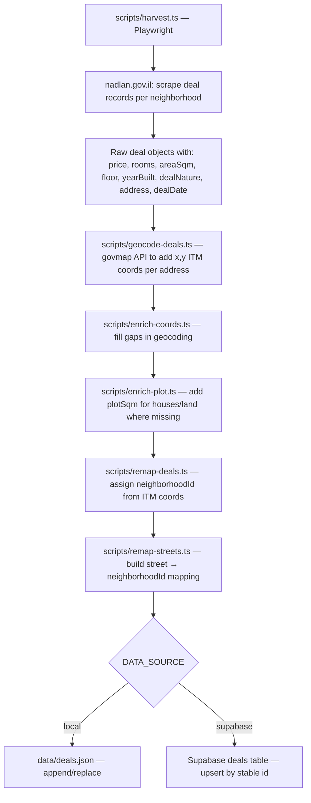
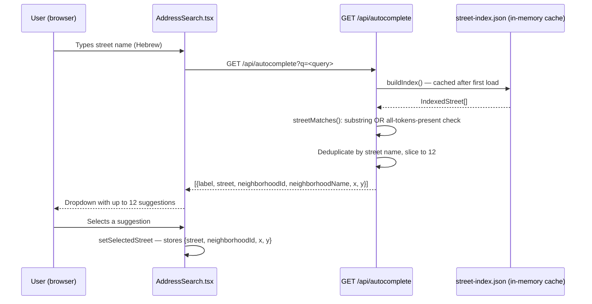
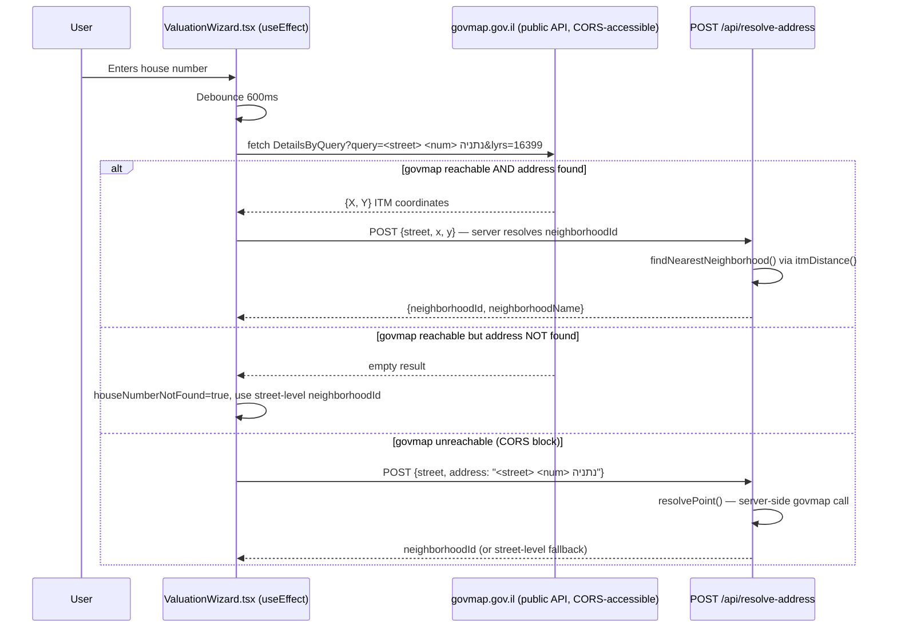
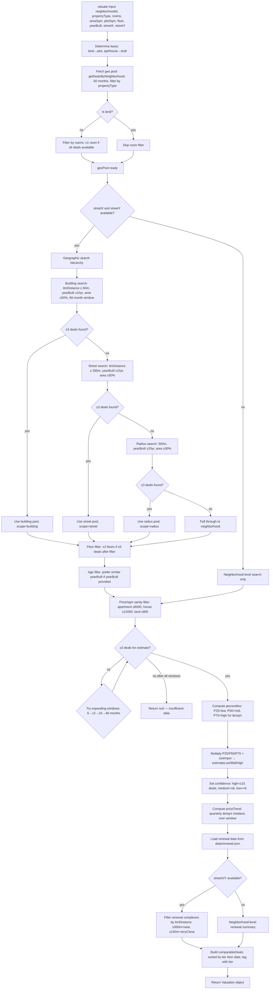
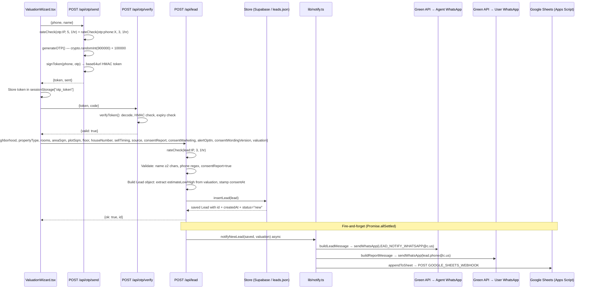
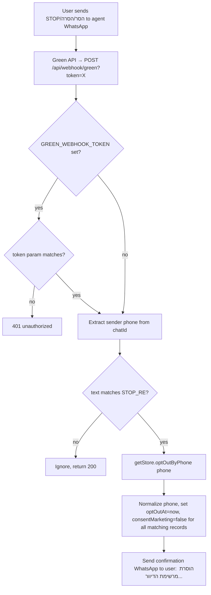

# Audit 02 — Data Flow

**Project:** שווי דירה נתניה — Real-Estate Lead-Gen
**Audit date:** 2026-08-19
**Auditor:** Claude Sonnet 4.6 (forensic read-only pass)

---

## 1. Harvest → Deals Storage

### 1.1 Source

- **Origin:** nadlan.gov.il (Israel Tax Authority real-estate transaction database)
- **Method:** Playwright browser automation (`scripts/harvest.ts`, `scripts/harvest-missing.ts`)
- **Anti-scrape status:** Protected. Harvest must be run manually and periodically (monthly suggested per MEMORY.md).
- **Status: VERIFIED** (script files confirmed; source URLs inferred from MEMORY.md + govmap Referer headers in lib/govmap.ts)

### 1.2 Harvest Pipeline



**Supplementary harvest scripts:**
- `scripts/fetch-renewal.ts` → `data/renewal.json` (urban renewal complexes, source: Renewal Authority)
- `scripts/fetch-cbs.ts` → CBS neighborhood demographics data
- `scripts/fetch-poi.ts` → `data/poi.json` (bus stops, train stations, schools, parks — OSM/GTFS via wgs84ToItm conversion)
- `scripts/fetch-all-streets.ts` + `scripts/harvest-streets.ts` → `data/street-index.json` (1,048 official streets mapped to neighborhoods)

### 1.3 Deal ID Stability

IDs are documented as "stable" — derived from block-parcel-subparcel + date + price (comment in `lib/types.ts`). This allows safe upsert without duplicates. **Status: LIKELY** (design intent documented; exact hash function not confirmed from visible code).

### 1.4 Deal Schema (lib/types.ts — VERIFIED)

```typescript
interface Deal {
  id: string;           // stable hash
  dealDate: string;     // ISO yyyy-mm-dd
  price: number;        // NIS
  propertyType: "apartment" | "house" | "land";  // derived from dealNature
  rooms: number | null;
  areaSqm: number | null;   // built area (null for land)
  plotSqm: number | null;   // plot area (house/land)
  floor: number | null;
  yearBuilt: number | null;
  dealNature: string | null; // e.g. "דירה בבית קומות"
  address: string | null;
  houseNumber: string | null;
  street: string | null;
  neighborhoodId: string;   // UNIQ_ID from nadlan
  neighborhood: string | null;
  settlement: string;        // "נתניה"
  x: number | null;          // ITM easting
  y: number | null;          // ITM northing
  pricePerSqm: number | null; // derived: price / areaSqm
}
```

### 1.5 Normalization

- `propertyType` is derived from `dealNature` string (exact mapping in harvest script — not audited)
- `pricePerSqm` is pre-computed at harvest time
- Coordinates are ITM (EPSG:2039), not WGS84 — converted via `wgs84ToItm()` (Snyder TM formula, verified in `lib/govmap.ts`)
- Addresses are as-published by nadlan.gov.il (Hebrew, not normalized for case or punctuation)

---

## 2. User Input → Autocomplete → Property Params

### 2.1 Street Search Flow



**Index loading (VERIFIED):**
1. Primary: `data/street-index.json` — each entry has `{street, neighborhoodId, neighborhoodName, x, y}`
2. Fallback: `data/streets.json` (neighborhood→[streets]) joined with `data/neighborhoods.json`

**Matching algorithm (VERIFIED):**
- Single-word or short queries: `street.includes(q)` (substring)
- Multi-word queries: every token must appear in the street name (order-independent)
- No fuzzy matching, no transliteration normalization

### 2.2 House Number → Neighborhood Resolution Flow



**Notes:**
- govmap is called client-side directly (public API, no auth) to get precise coordinates before house-number-level geocoding
- The server-side `/api/resolve-address` route also calls govmap via `lib/govmap.ts`
- `resolvePoint()` has a 30-minute in-memory cache per URL (VERIFIED, lib/govmap.ts line 23-25)
- `itmDistance()` is Euclidean distance in ITM meters (VERIFIED, lib/govmap.ts line 111)

### 2.3 Property Params Collected (VERIFIED from ValuationWizard.tsx)

| Parameter | Type | Validation (client) | Validation (server) |
|---|---|---|---|
| `neighborhoodId` | string | Required (button disabled) | Must match DB neighborhood |
| `propertyType` | "apartment"\|"house"\|"land" | Required (button toggle) | Defaults to "apartment" |
| `rooms` | number (2–6, 0.5 steps) | Required for non-land | Passed as-is |
| `areaSqm` | number | 20–400 (apt), 40–1000 (house) | None additional |
| `plotSqm` | number | 100–5000 | None additional |
| `floor` | number | None (freeform) | None |
| `yearBuilt` | number (bucketed) | Buttons: 1965/1982/1997/2010/2020 | None |
| `houseNumber` | string | None | None |
| `streetName` | string | From autocomplete | None |
| `streetX`, `streetY` | number (ITM) | From autocomplete/govmap | None |

**Gap: `floor` and `yearBuilt` have no server-side validation.** A client sending floor=-999 or yearBuilt=1800 would not be rejected. VERIFIED (valuation/route.ts passes values directly to `valuate()`).

---

## 3. Property Params → Valuation → Result

### 3.1 Entry Point

`POST /api/valuation/route.ts` calls `valuate(input: PropertyInput)` from `lib/valuation.ts`.

Before calling `valuate()`, the route:
1. Lists neighborhoods from store
2. Resolves `neighborhoodId` from `body.neighborhoodId` or falls back to `resolveNeighborhoodId(body.query, neighborhoods)` which does: govmap point resolution → nearest neighborhood by ITM distance
3. If `houseNumber` + `streetName` present, calls `resolvePoint(fullAddr)` to get precise ITM coords
4. Passes all to `valuate()`

### 3.2 Valuation Algorithm (lib/valuation.ts — VERIFIED lines 1-150)



### 3.3 Key Constants (VERIFIED from lib/valuation.ts lines 7-104)

| Constant | Value | Purpose |
|---|---|---|
| `BUILDING_RADIUS` | 60m | Same building/entrance |
| `STREET_RADIUS` | 350m | Same street/block |
| `COMP_RADIUS_LADDER` | [500m] | Radius search levels |
| `GEO_MONTHS` | 60 (5 years) | Geo pool time window |
| `AGE_TOLERANCES` | building:10yr, street:15yr, radius:20yr | Year-built filter |
| `AREA_TOLERANCE_RATIO` | 0.5 (±50%) | Area filter for comparables |
| `FLOOR_TOLERANCE` | ±2 floors | Floor filter |
| `MIN_DEALS_FOR_ESTIMATE` | 3 | Minimum to return result |
| `MIN_DEALS_FOR_ROOM_FILTER` | 6 | Minimum to enable room filter |
| `MIN_DEALS_FOR_FLOOR_FILTER` | 5 | Minimum to enable floor filter |
| `MIN_COMPOSITE_DEALS` | 6 | Min for composite house model |
| `WINDOWS` | [6, 12, 24, 48] months | Fallback time windows (neighborhood) |
| `MIN_PPSQM.apartment` | ₪8,000/sqm | Sanity filter — removes partial sales |
| `MIN_PPSQM.house` | ₪12,000/sqm | Sanity filter |
| `MIN_PPSQM.land` | ₪800/sqm | Sanity filter (agricultural land) |
| `HOUSE_MAX_PPSQM_BUILT` | ₪40,000/sqm | Composite model reliability gate |
| `RENEWAL_VERY_CLOSE` | 150m | Urban renewal distance tier |
| `RENEWAL_NEAR` | 500m | Urban renewal distance tier |

### 3.4 Valuation Output Schema (VERIFIED from lib/types.ts)

```typescript
interface Valuation {
  estimateLow: number;     // P25 ₪/sqm × size
  estimateMid: number;     // P50 ₪/sqm × size
  estimateHigh: number;    // P75 ₪/sqm × size
  pricePerSqmLow/Mid/High: number;
  pricePerSqmBasis: "built" | "plot";
  propertyType: PropertyType;
  basedOnDeals: number;
  windowMonths: number;
  floorAdjusted?: boolean;
  compRadiusMeters?: number | null;
  compSearchScope?: "building" | "street" | "radius" | "neighborhood";
  priceTrend?: PriceTrend | null;
  neighborhood: string | null;
  comparableDeals: ComparableDeal[];
  renewal?: RenewalInfo | null;
  confidence: "high" | "medium" | "low";
  asOf: string;            // latest dealDate in dataset
  compositeUsed?: boolean;
  plotNotValued?: boolean;
}
```

**No validation of the Valuation object before returning it to client.** The full Valuation object (including all comparable deals with street addresses) is sent to the browser and later re-submitted in the lead POST body. VERIFIED.

---

## 4. User Contact Form → Lead API → DB + Notifications

### 4.1 Full Data Flow



### 4.2 Lead Object Transformations

**From client form:**
```
name          → trim
phone         → replace(/[-\s]/g, "")
address       → address.trim() OR neighborhoodName (fallback)
neighborhood  → valuation.neighborhood OR neighborhoodName
consentReport → boolean (explicit true required)
consentMarketing → boolean (defaults false)
alertOptIn    → boolean (defaults false)
valuation     → full Valuation object passed through
```

**Server-side extractions:**
```
estimateLow    ← body.valuation.estimateLow
estimateHigh   ← body.valuation.estimateHigh
consentAt      ← new Date().toISOString()
status         ← "new" (default)
id             ← "lead_" + Date.now() (local) / UUID (Supabase auto)
```

**Fields stored but NOT validated:**
- `address` (free string from client)
- `neighborhood` (free string from client)
- `source` (UTM param / referrer from client)
- `sellTiming` ("now" / "year" / "curious" — no enum validation)
- `houseNumber` (free string)
- `consentWordingVersion` (free string — currently `"2026-06-v1"`)
- All valuation fields (estimateLow/High — no range validation)

### 4.3 Phone Normalization (VERIFIED from lib/store.ts)

```typescript
// normalizePhone: strips dashes/spaces, converts 972-prefix → 0-prefix
let s = (p || "").replace(/[-\s]/g, "");
if (s.startsWith("+")) s = s.slice(1);
if (s.startsWith("972")) s = "0" + s.slice(3);
```

Used in `optOutByPhone()` for comparison. Phone is stored as-submitted (after client-side `replace(/[-\s]/g, "")`). Multiple formats could represent the same phone in DB. VERIFIED.

### 4.4 Consent Metadata (VERIFIED from lib/types.ts + lead/route.ts)

Per Israel Privacy Protection Law Amendment 13 + Anti-Spam Law:

| Field | Purpose | Stored |
|---|---|---|
| `consentReport` | Mandatory consent to receive report via WhatsApp | Always `true` (required) |
| `consentMarketing` | Optional marketing communication consent | As submitted |
| `consentWordingVersion` | Version string of consent text shown | `"2026-06-v1"` |
| `consentAt` | Timestamp of consent | Server-stamped ISO timestamp |
| `alertOptIn` | Optional market-alert subscription | As submitted |
| `optOutAt` | Opt-out timestamp | Set on STOP webhook |

### 4.5 WhatsApp Message Formats (VERIFIED from lib/notify.ts)

**Agent notification (buildLeadMessage):**
```
🔥🔥 *ליד חם — שווי דירה נתניה*   (if sellTiming=now)
🔔 *ליד חדש — שווי דירה נתניה*   (otherwise)
[TIMING_LABEL]
👤 [name]
📞 [phone]
📍 [address]
🏘️ [neighborhood]
🏠 [rooms] חד' · [areaSqm] מ"ר
💰 אומדן: [estimateLow]–[estimateHigh]
[consent marketing badge]
📊 מקור: [source]
```

**User report (buildReportMessage):**
```
שלום [name], הנה דוח השווי שביקשת 🏠
📍 [neighborhood], נתניה
🏠 [rooms] חד' · [areaSqm] מ"ר

💰 טווח שווי משוער:
[estimateLow] – [estimateHigh]
📊 ≈ [pricePerSqmMid] למ"ר · מבוסס על [basedOnDeals] עסקאות אמיתיות באזור

עסקאות שנמכרו לאחרונה באזורך:
• [street] [rooms] חד' [areaSqm] מ"ר — [price]  (up to 4 deals)

אחזור אליך בהקדם עם סקירה מותאמת אישית. נשמח לעמוד לרשותך!

— [AGENT_NAME], מתווך מורשה (רישיון [LICENSE])
* אינדיקציית מחיר לפי עסקאות פומביות (רשות המסים) — אינה הערכת שמאי.
להסרה מרשימת הדיוור השב/י STOP.
```

**Street-level deal addresses are included in the WhatsApp message sent to the user.** VERIFIED.

### 4.6 Google Sheets Webhook Payload (VERIFIED from lib/notify.ts)

```json
{
  "createdAt": "ISO timestamp",
  "name": "string",
  "phone": "string",
  "email": "string or empty",
  "address": "string or empty",
  "neighborhood": "string or empty",
  "rooms": "number or empty",
  "areaSqm": "number or empty",
  "estimateLow": "number or empty",
  "estimateHigh": "number or empty",
  "source": "string or empty"
}
```

**Note:** `sellTiming`, `consentMarketing`, `alertOptIn`, and `consentAt` are NOT sent to Google Sheets. The Sheets record is therefore incomplete for legal audit purposes. VERIFIED.

---

## 5. Opt-Out / STOP Flow



**Note:** The opt-out webhook token is optional. If `GREEN_WEBHOOK_TOKEN` is not set, any caller can trigger opt-out for any phone number by crafting a JSON body. VERIFIED from webhook/green/route.ts lines 37-39.

---

## 6. End-to-End Data Lineage Summary

```
nadlan.gov.il → harvest.ts (Playwright)
  ↓
raw deal records (price, rooms, area, floor, date, address, dealNature)
  ↓ geocode-deals.ts
+x, +y (ITM via govmap.gov.il DetailsByQuery)
  ↓ remap-deals.ts
+neighborhoodId (nearest neighborhood centroid by itmDistance)
  ↓ enrich-plot.ts
+plotSqm (where available for houses)
  ↓
data/deals.json  OR  Supabase deals table
  ↓ (runtime)
getStore().getDealsByNeighborhood(neighborhoodId, {monthsBack: 60})
  ↓ lib/valuation.ts: valuate()
geo-filtered, age-filtered, area-filtered, sanity-filtered deals
  ↓
P25/P50/P75 of ₪/sqm × user's size input
  ↓
Valuation{estimateLow, estimateMid, estimateHigh, comparableDeals, ...}
  ↓ (HTTP response to browser)
Displayed to user in ValuationWizard step 3
  ↓ (user submits lead form + OTP)
POST /api/lead: Lead{name, phone, neighborhood, valuation estimates, consent metadata}
  ↓
Supabase leads table  OR  data/leads.json
  ↓ (parallel, best-effort)
  ├─ Green API → Agent WhatsApp (lead notification with hot/warm/cold badge)
  ├─ Green API → User WhatsApp (valuation report + top 4 comparable deals with addresses)
  └─ Google Sheets (partial record — no consent metadata)
```

---

## 7. Data Validation Summary

| Stage | What is validated | What is NOT validated |
|---|---|---|
| Client (Step 1) | neighborhoodId present | Street name format |
| Client (Step 2) | Area range, plot range | yearBuilt range, floor range |
| Client (Step 3) | Phone regex (0XXXXXXXXX), name ≥2 chars, consentReport | OTP delivery confirmation |
| POST /api/otp/send | Phone regex, rate limits | Name content |
| POST /api/otp/verify | HMAC + expiry | Code brute-force (no rate limit on this endpoint) |
| POST /api/valuation | neighborhoodId resolves to known neighborhood | area/floor/yearBuilt ranges |
| POST /api/lead | Phone regex, name length, consentReport=true, rate limit | address content, neighborhood format, valuation object integrity, sellTiming enum |
| Store.insertLead | None (accepts Lead object as-is) | None |

---

## 8. Environment Variables Required

| Variable | Used In | Purpose |
|---|---|---|
| `DATA_SOURCE` | lib/store.ts | "supabase" or "local" (default) |
| `NEXT_PUBLIC_SUPABASE_URL` | SupabaseStore | Supabase project URL |
| `SUPABASE_SERVICE_ROLE_KEY` | SupabaseStore | Supabase service role key |
| `OTP_SECRET` | lib/otp.ts | HMAC signing key (CRITICAL — insecure default exists) |
| `GREEN_API_ID_INSTANCE` | lib/notify.ts, otp/send | Green API WhatsApp instance ID |
| `GREEN_API_TOKEN_INSTANCE` | lib/notify.ts, otp/send | Green API token |
| `LEAD_NOTIFY_WHATSAPP` | lib/notify.ts | Agent's WhatsApp number (without @c.us) |
| `GOOGLE_SHEETS_WEBHOOK` | lib/notify.ts | Apps Script Web App URL |
| `GREEN_WEBHOOK_TOKEN` | webhook/green | Opt-out webhook security token (optional) |
| `ADMIN_EMAIL` | auth.ts | Restrict admin login to this email |
| `INFORU_USER` + `INFORU_PASS` | otp/send | Inforu SMS (primary OTP provider) |
| `TWILIO_ACCOUNT_SID` + `TWILIO_AUTH_TOKEN` | otp/send, otp/verify | Twilio SMS |
| `TWILIO_FROM` | otp/send | Twilio sender number |
| `TWILIO_VERIFY_SID` | otp/send, otp/verify | Twilio Verify service (if preferred over raw SMS) |
| `NEXT_PUBLIC_AGENT_NAME` | ValuationWizard, notify | Agent display name |
| `NEXT_PUBLIC_AGENT_LICENSE` | ValuationWizard, notify | Agent license number |
| `NEXT_PUBLIC_AGENT_PHOTO` | ValuationWizard | Agent photo URL |
| `NEXT_PUBLIC_AGENT_TESTIMONIAL` | ValuationWizard | Agent testimonial quote |
| `NEXT_PUBLIC_DEV_BYPASS_OTP` | ValuationWizard | "true" to bypass OTP in dev |
| `ADMIN_DEV_BYPASS` | middleware.ts | "true" to bypass auth in dev (dangerous) |

---

## 9. Known Data-Flow Risks (Read-Only Findings, No Fixes Applied)

| Finding | Location | Severity | Status |
|---|---|---|---|
| `OTP_SECRET` defaults to `"dev-otp-secret-change-in-production"` | lib/otp.ts line 11 | HIGH | VERIFIED |
| `/api/otp/verify` has no rate limit — HMAC brute-force possible if OTP_SECRET weak | app/api/otp/verify/route.ts | MEDIUM | VERIFIED |
| `/api/valuation` has no rate limit — deal data enumerable | app/api/valuation/route.ts | LOW-MEDIUM | VERIFIED |
| `/api/webhook/green` opt-out auth is optional (no token = no auth) | app/api/webhook/green/route.ts lines 37-39 | MEDIUM | VERIFIED |
| `ADMIN_DEV_BYPASS=true` with non-production NODE_ENV bypasses all admin auth | middleware.ts lines 6-10 | HIGH (if misconfigured) | VERIFIED |
| `/api/dev/save-streets` has no auth guard | app/api/dev/save-streets/route.ts | MEDIUM | LIKELY (not read) |
| Full valuation object (with street addresses) re-submitted by client in lead POST — server trusts client's estimate values | app/api/lead/route.ts lines 83-84 | LOW | VERIFIED |
| Google Sheets webhook omits consent metadata | lib/notify.ts appendToSheet | LOW (compliance) | VERIFIED |
| In-memory rate limiter resets per Vercel invocation instance — not cross-instance | lib/rateLimit.ts | MEDIUM | VERIFIED |
| Phone stored in multiple formats (0XXXXXXXXX vs 972XXXXXXXXX) — optOut may miss records | lib/store.ts SupabaseStore.optOutByPhone | LOW | VERIFIED (mitigated: tries both formats) |
